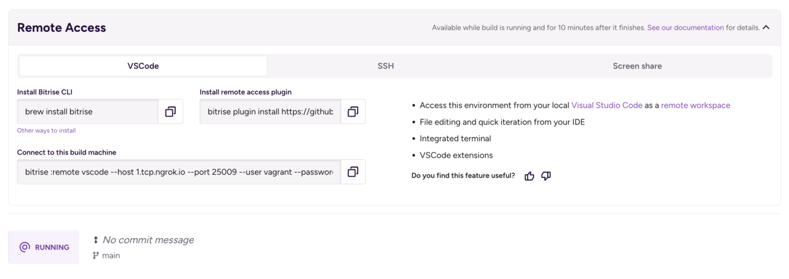
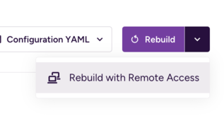

# Remote access CLI for [Bitrise](https://bitrise.io) builds

This [Bitrise CLI plugin](https://github.com/bitrise-io/bitrise) is the automation that powers the remote build access feature and integration with editors like [Visual Studio Code](https://code.visualstudio.com/):



## How to use

If Bitrise CLI is not yet installed on your system, do it first: `brew install bitrise` ([other ways to install](https://github.com/bitrise-io/bitrise?tab=readme-ov-file#install))

Then install this plugin:
```
bitrise plugin install https://github.com/bitrise-io/bitrise-remote-access-cli.git
```

Finally, select a Bitrise build and hit _Rebuild with Remote Access_:



...and copy the command with the connection parameters that sets up the remote connection on your machine and launches the editor.
